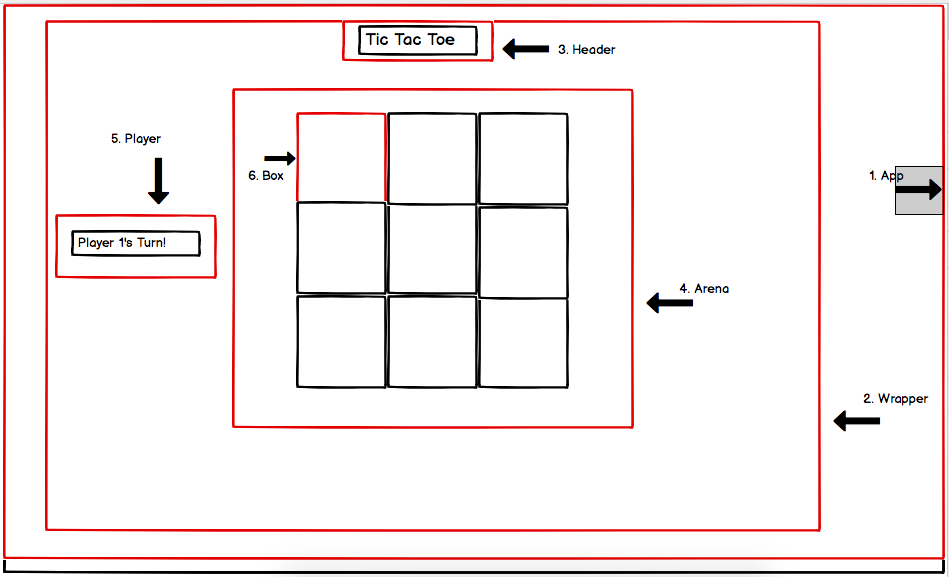

# Tic Tac Toe

## How to use

To start up the app first run:

```
npm install
```

to install all the packages.
<br />
To run the application:

```
npm start
```

## My approach

first, to ensure I could get something to render to the screen, I built out the app component in a TDD manner that would be rendered in index.js.

I then diagrammed out the first screen of the app, and split it into components so that i could narrow my focus and take it component by component.



I decided to start with the Header, as I had already written a h1 within my already built App component, and could simply extract that out into its own component.

Once this was done, I built a 'Smart' Wrapper container, which would hold the applications state.

from here, I began TDD'ing the remaining components that the wrapper would hold, and the pieces of state that would affect them.

Once the basic components were built out (without much state or functionality), I started focus on the following rules one by one and work on implementing them.

### Feature list:

* There are two players in the game (X and O)
* Players take turns until the game is over
* A player can claim a field if it is not already taken
* A turn ends when a player claims a field
* A player wins if they claim all the fields in a row, column or diagonal
* A game is over if a player wins
* A game is over when all fields are taken
